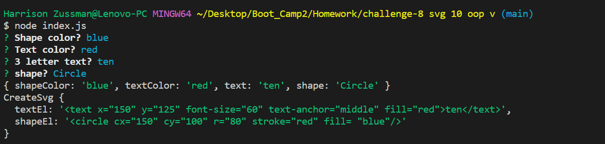
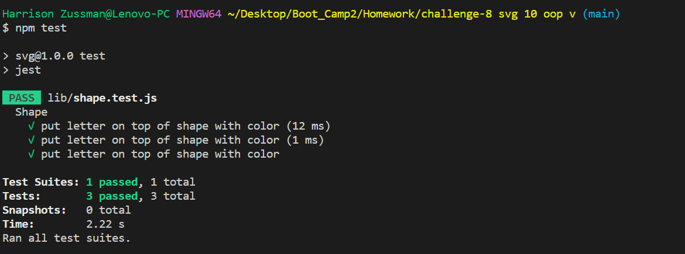
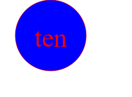

# <Title>
SVG generater

## Desciption

The challenge for this assignment is to use a combination of (module.exports) and test it using the lib folder. My method of putting this app together was get the shade then inquirer after that test it. the (lib/shape.js) was the first thing I did because shape sturcure never change so i used that as a base. After I picked the shapes the next thing I did was the question with inquirer to pick the colors for the text and shape in the (index.js). the file (lib/svg.js) combines them. the last thing I did was test it out with (lib/shape.test.js). the outcome is (logo.svg).

## Installation
you need the do npm install inquirer. then node index.js answer the question. the file will pop up as logo.svg right click and pick (open with live server) or (open perveiw)

## usage
if you want to make a quick and simple logo or an icon for the computer this makes it possable.

## Features
jest
inquirer

## screenshot

## video
